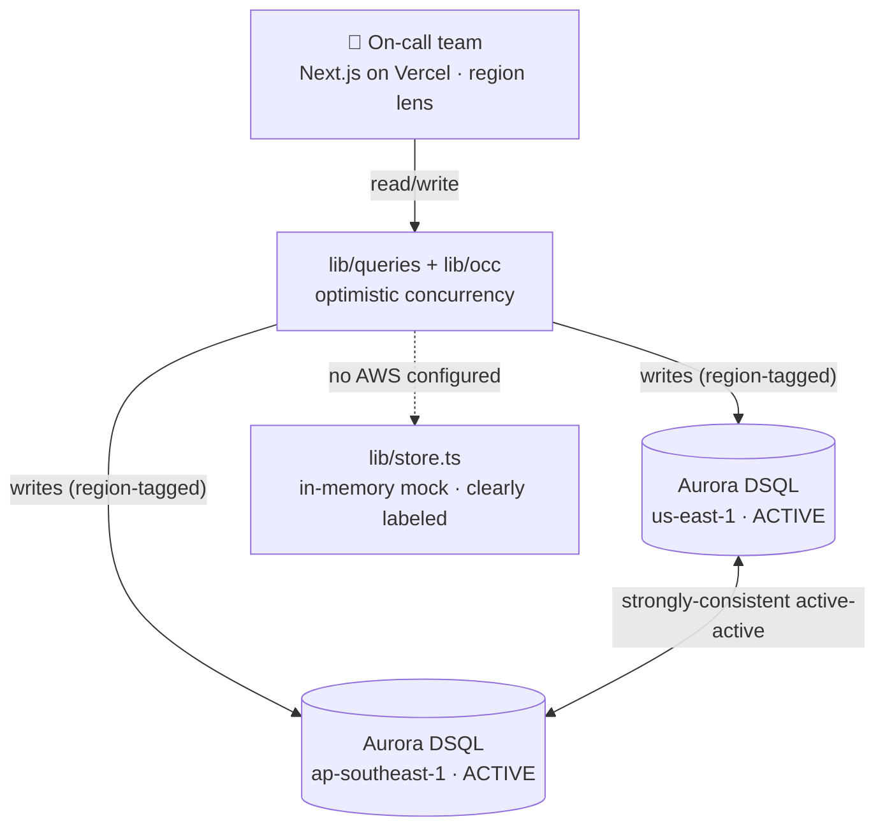

# ShipLog

**Status that never goes down.** A multi-region status page + incident timeline for global on-call
teams, built on **Amazon Aurora DSQL** (active-active, us-east-1 ⟷ ap-southeast-1) and deployed on Vercel.

[](https://shiplog-sandy.vercel.app)
&nbsp;[](./DECK.pdf)


> 🟢 **Live:** https://shiplog-sandy.vercel.app &nbsp;·&nbsp; 📊 **Pitch deck:** [DECK.pdf](./DECK.pdf)

## Architecture



> Track 4 · Open Innovation · AWS × Vercel Hackathon. UI generated with **v0**, then wired onto the real
> Aurora DSQL backend. The strongest *Most Original* shot: DSQL used for the one workload it was built
> for — strongly-consistent writes from multiple regions at once, surviving any single-region failure.

This is the **canonical ShipLog app**: the polished v0 frontend on a production DSQL data layer
(`lib/dsql.ts` + `lib/occ.ts` + `lib/queries.ts`), with an in-memory mock fallback so it runs with zero AWS.

## Run it locally (mock mode, no AWS needed)

```bash
npm install
npm run dev      # http://localhost:3000
```

With no DSQL endpoint configured, ShipLog serves an in-memory store ([lib/store.ts](lib/store.ts))
seeded with a live two-region incident. **Mock mode is clearly labelled** in the UI — it never fakes the
cross-region guarantee. Explore the status page, the on-call console, and the conflict/retry UX.

### Drive the multi-region demo

Open two browser windows of the same app:

- Window A → `/admin?region=ap-southeast-1` (Singapore lens)
- Window B → `/admin?region=us-east-1` (Virginia lens)

Each window's writes are tagged with — and on real DSQL, routed to — its region. The `?region=` lens
is switchable in-app too. Post updates / flip component status from both at once and watch the timeline
stay consistent; on live DSQL, same-row edits show the OCC auto-retry.

## Go live on Aurora DSQL

1. **Provision** a DSQL **multi-region cluster** with peers in `us-east-1` and `ap-southeast-1`. Note the
   two endpoint hostnames.
2. **Configure** `.env.local` (see [.env.example](.env.example)):
   ```bash
   DSQL_HOST_VIRGINIA=<virginia-endpoint>.dsql.us-east-1.on.aws
   DSQL_HOST_SINGAPORE=<singapore-endpoint>.dsql.ap-southeast-1.on.aws
   DSQL_HOST=$DSQL_HOST_VIRGINIA      # used by the db scripts
   AWS_REGION=us-east-1
   AWS_ROLE_ARN=arn:aws:iam::<acct>:role/shiplog-dsql   # credential-less via Vercel OIDC
   ```
   IAM auth — **no password**. The `DsqlSigner` mints a short-lived (~15 min) admin token per connection.
3. **Apply schema + seed** (DDL propagates across the multi-region cluster):
   ```bash
   npm run db:schema
   npm run db:seed
   ```
4. `npm run dev` — same UI, now reading/writing real DSQL. The mock banner disappears and real OCC
   `retries` start surfacing in the post-update toast.

## How it's wired

```
components/shiplog/*   v0-generated UI (status board, timeline, region badge/switcher, forms) — unchanged
app/api/*              thin routes: parse region + body → call lib/queries.ts → return UI-shaped JSON
lib/queries.ts         real Aurora DSQL when configured; else delegates to lib/store.ts (mock)
lib/dsql.ts            one cached Pool per region; per-connection IAM token (DsqlSigner / OIDC)
lib/occ.ts             OCC retry on SQLSTATE 40001 — this IS the multi-region story
lib/store.ts           in-memory mock used only when no DSQL host is set
db/schema.sql          DSQL-safe schema (app UUIDs, no FKs, no sequences)
scripts/               db.mjs · run-sql.mjs (one statement per tx) · seed.mjs
docs/                  architecture.md · stitch-ui-spec.md · v0-ui-spec.md
```

Full architecture + the DSQL-correctness decisions: [docs/architecture.md](docs/architecture.md).

## The 60-second story

When your service is down, your status page can't be too — and your on-call team is global. Engineers in
**Singapore** and **Virginia** post to the same incident timeline simultaneously:

- **Different-row writes** → both commit, strongly consistent, correctly ordered.
- **Same-row writes** → DSQL's optimistic concurrency control rejects one with a retryable error; ShipLog
  auto-retries and shows the count (`✓ Committed via us-east-1 — auto-retried 2×; nothing lost`).
  You can never get a silent lost write — and that's exactly why we chose Aurora DSQL.

## Tech

Next.js 16 (App Router) · React 19 · Tailwind v4 · base-ui · `pg` · `@aws-sdk/dsql-signer` ·
`@vercel/oidc-aws-credentials-provider` · Amazon Aurora DSQL · Vercel.

---

*ShipLog · Track 4 Open Innovation · Aurora DSQL · lowest competition, highest novelty.*
