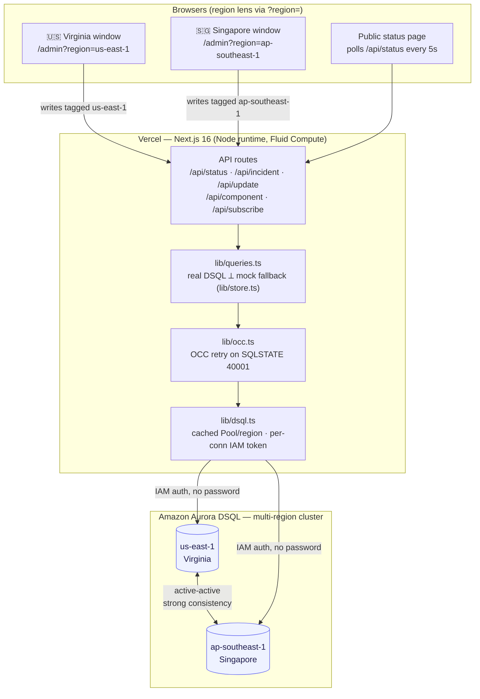

# ShipLog — Architecture

Status page + incident timeline that stays up during an outage, accepting **strongly-consistent
writes from any region at once** via Amazon Aurora DSQL (active-active, us-east-1 ⟷ ap-southeast-1).

## System diagram



## Request paths

| Flow | Path |
|---|---|
| Public read | browser polls `GET /api/status?region=` → `getStatus()` → DSQL nearest endpoint → `StatusPayload` |
| Post update | `POST /api/update?region=` → `postUpdate()` → `withOccRetry(tx: insert update + update incident)` → re-read incident → `{incident, result:{retries,region}}` |
| Flip component | `POST /api/component?region=` → `setComponentStatus()` → `withOccRetry(tx: UPDATE components …)` → `{component, result}` |
| Declare incident | `POST /api/incident?region=` → `createIncident()` → tx(insert incident + first update) → `{incident, result}` |

## The multi-region guarantee (what the demo shows)

1. **Different-row writes** — Virginia and Singapore each post a *different* update to the same
   incident at the same instant → both commit, strongly consistent, correctly ordered. No coordination.
2. **Same-row writes** — both set the incident's `status` simultaneously → Aurora DSQL's **optimistic
   concurrency control** rejects one with a retryable serialization error (`SQLSTATE 40001`);
   `withOccRetry` replays it and the UI shows `✓ Committed via us-east-1 — auto-retried 2×; nothing lost`.
   DSQL refuses to lose a write rather than pretend conflicts don't exist — that's *why* DSQL.

## DSQL-correctness decisions (baked into the code)

| Concern | Decision | File |
|---|---|---|
| No `gen_random_uuid()` / FKs / sequences | App-generated UUIDs (`crypto.randomUUID()`); relations enforced in code, no FK constraints | [db/schema.sql](../db/schema.sql), [lib/queries.ts](../lib/queries.ts) |
| OCC, not "no conflicts" | Retry `40001` and surface the retry count as the feature | [lib/occ.ts](../lib/occ.ts) |
| Per-request token signing = churn | One cached `Pool` per region; pg signs a fresh IAM token only on a *new* physical connection | [lib/dsql.ts](../lib/dsql.ts) |
| One-DDL-per-transaction; `json_agg` subset risk | Schema applied one statement per tx; reads fetch rows separately and stitch in JS | [scripts/run-sql.mjs](../scripts/run-sql.mjs), [lib/queries.ts](../lib/queries.ts) |
| Credential-less auth | IAM via Vercel OIDC (`AWS_ROLE_ARN`), default chain fallback for local | [lib/dsql.ts](../lib/dsql.ts) |

## Mock vs live

`lib/queries.ts` checks `dsqlConfigured()`. With no `DSQL_HOST_*` set it delegates to the in-memory
mock ([lib/store.ts](../lib/store.ts)) and the UI shows a **"Mock mode"** banner — it never fakes the
cross-region guarantee. Set the two endpoints + `AWS_ROLE_ARN`, run `npm run db:schema && npm run db:seed`,
and the same UI is backed by real DSQL with real OCC retries.
```
ASCII fallback (for the slide deck):

   🇺🇸 Virginia win ─┐                 ┌─ public status page (polls /api/status)
   🇸🇬 Singapore win ─┤  Vercel Next.js │
                     ├─► routes ─► queries.ts ─► occ.ts ─► dsql.ts
                     │                                        │ IAM (no pw)
                     └────────────────────────────────────┐  ▼
                       Aurora DSQL  us-east-1  ⟷  ap-southeast-1  (active-active)
```
